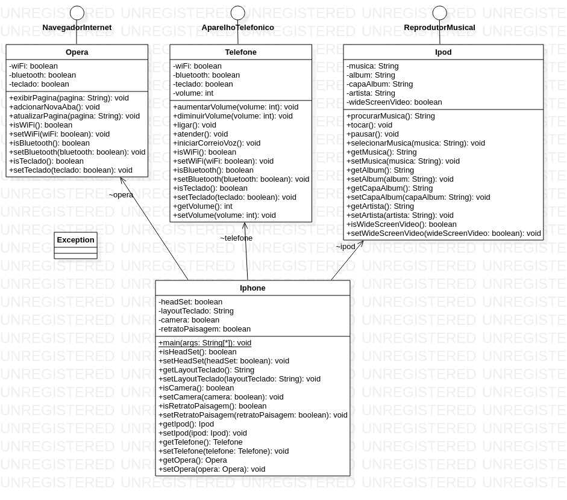

# Diagramação de Classes do iPhone

#### Autores
- [Gleyson Sampaio](https://github.com/glysns)

## 🚀 Sobre mim
Meu nome é Marcelo Bomfim sou bacharel em Sistema de informação e atualmente busco oportunidades nas áreas de desenvolvimento ou banco de dados.

## 🎓 Certificações
| Nome          | Credenciais |
| ------------- | ------------- |
| Java Certified Foundations Associate   | [Ver Credencial](https://catalog-education.oracle.com/pls/certview/sharebadge?id=8FA2B68F57D8C9B22F326C3E804F1EE9377AE26CCC36219B4B64B88694CFE6DB)  |
|  Oracle Cloud Infrastructure 2023 Certified Foundations Associate  | [Ver Credencial](https://catalog-education.oracle.com/pls/certview/sharebadge?id=840A0F0DF7947CB00E78246727FA7A9D9BFA63A69E34B6A4D96B7523C31CF514)  |
| Oracle Cloud Data Management 2023 Certified Foundations Associate   | [Ver Credencial](https://catalog-education.oracle.com/pls/certview/sharebadge?id=04A007129A4FC3494F29F0694E7B2331A1EC7682ABF40F30457B2CF8C7E480B3)  |

## POO - Desafio

Modelagem e diagramação da representação em UML e Código no que se refere ao componente iPhone.

Com base no vídeo de lançamento do iPhone conforme link abaixo, elabore em uma ferramenta de UML de sua preferência a diagramação das classes e interfaces com a proposta de representar os papéis do iPhone de: Reprodutor Musicial,  Aparelho Telefônico e Navegador na Internet. Em seguida crie as classes e interfaces no formato de arquivos .java

[Lançamento iPhone 2007](https://www.youtube.com/watch?v=9ou608QQRq8)

- Minutos relevantes do 00:15 até 00:55

###### Comportamentos esperados:
* Repodutor Musicial: tocar, pausar, selecionarMusica
* Aparelho Telefônico: ligar, atender, iniciarCorrerioVoz
* Navegador na Internet: exibirPagina, adicionarNovaAba, atualizarPagina

